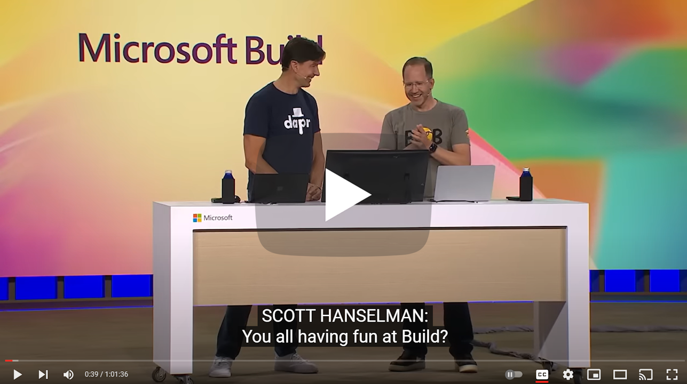

# Mark and Scott Learn to Code - the BUILD 2023 "Locknote" featuring GitHub Copilot Chat and Visual Studio

This is the Asteroids Game generated by Scott and Mark Learn to Code, commited directly as written, just after BUILD 2023 keynote. Many many thanks to Yanan Cai for her help and prompt engineering.

If you want to try to start where we started and follow along, generating code with GitHub Copilot, check out the "startpoint" branch - that's where we started!

Watch the talk where this project was created live with GitHub Copilot at http://aka.ms/Build/ScottandMark

## Project Structure 
AsteroidsGame solition is a .Net Web App which implements the multi-player game backend in C# and front end canvas in Javascript using SignalR technology. 

All game backend is under AsteroidsGame project, including:
- SignalR Hub
- Core game logic
- Framing queue and service
- Asteroid, bullet, spaceship/player classes.

All game Javascript and other rendering resources are under wwwroot folder. 

## References for the session
- [ChatGPT Prompt Engineering for Developers](https://www.deeplearning.ai/short-courses/chatgpt-prompt-engineering-for-developers/)
- [Sparks of Artificial General Intelligence: Early experiments with GPT-4](https://arxiv.org/abs/2303.12712)
- [Attention Is All You Need](https://arxiv.org/abs/1706.03762)
- [Chain-of-Thought Prompting Elicits Reasoning in Large Language Models](https://arxiv.org/abs/2201.11903)
- [Language Models are Few-Shot Learners](https://arxiv.org/abs/2005.14165) 
- [Aligning language models to follow instructions](https://openai.com/research/instruction-following)
- [LoRA: Low-Rank Adaptation of Large Language Models](https://arxiv.org/abs/2106.09685)
- [How GitHub Copilot is getting better at understanding your code](https://github.blog/2023-05-17-how-github-copilot-is-getting-better-at-understanding-your-code/)

